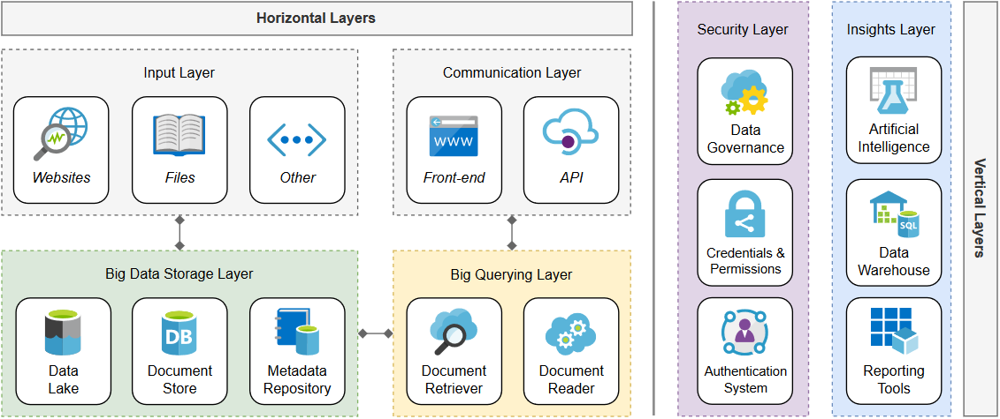

# BigQA: A Software Reference Architecture for Big Data Question Answering Systems

[](https://github.com/leomaurodesenv/big-qa-architecture)
[](LICENSE)
[](https://github.com/leomaurodesenv/big-qa-architecture/actions/workflows/continuous-integration.yml)


Question Answering (QA) is the task of answering questions written in natural language automatically (typically reading comprehension questions). QA systems can be used in a variety of use cases. For example, they can extract information from knowledge bases, like a "sophisticated search engine". A knowledge base can be a set of websites, internal documents, or a collection of reports. Knowledge bases can easily reach Big Data characteristics of volume, velocity, and variety. This repository presents design principles and a software reference architecture for Big Data QA systems.

<p align="center"></p>

_Figure source: [The Stanford Question Answering Dataset](https://rajpurkar.github.io/mlx/qa-and-squad/)_.

> **Paper**: 📄 [Design Principles and a Software Reference Architecture for Big Data Question Answering Systems, 2023](https://doi.org/10.5220/0011842700003467)
> **Paper**: 📄 [BigQA: A Software Reference Architecture for Big Data Question Answering Systems, 2024](https://link.springer.com/chapter/10.1007/978-3-031-64748-2_3)
> **Abstract**: Querying massive and heterogeneous text data is challenging, transcending different business domains. Our study outlines the BigQA architecture, which is specifically designed to support text data queries on Big Data systems using natural language. The architectural design comprises several layers that are intentionally built to be independent of the programming language, technology, and querying algorithm utilized. Nevertheless, the implementation of this architecture remains unclear. In this study, we showcase the versatility and adaptability of BigQA by offering a comprehensive set of guidelines and three practical implementation pipelines. In addition, we performed 60 experiments on four different datasets and compared the recall results of three popular algorithms: BM25, TF-IDF, and DPR. Based on our experiments, BM25 had the best overall performance as a document query algorithm.

**Table of Contents**
- [BigQA Architecture](#safe-bigqa-architecture)
- [QA Experiments](#qa-experiments)
- [Resources](#resources)

---

<a id="safe-bigqa-architecture"></a>

## Safeguarding BigQA Architecture

We proposed _BigQA_, the first Big Data Question Answering architecture. It comprises six layers, as depicted in Figure.

<p align="center"></p>

1. Input, the ingestion of documents;
2. Big Data Storage, the storage and processing of the data;
3. Big Querying, the query engine;
4. Communication, the user interface;
5. Security, the security artifacts;
6. Insights, the data analysis support.

---

<a id="qa-experiments"></a>

## Jailbreak Experiments

```sh
# Install the project dependencies
uv sync

# (Optional) Login to Hugging Face Hub (required for some models)
uv run hf auth login
```

### Datasets

A collection of datasets used in algorithm experiments.

- [AdversarialQA](https://huggingface.co/datasets/adversarial_qa) - Complex Question Answering dataset.
- [DuoRC](https://huggingface.co/datasets/duorc) - Questions about Wikipedia and IMDb movie plots.
- [SQuAD](https://huggingface.co/datasets/squad) - Traditional QA dataset from Stanford.
- [QASports](https://huggingface.co/datasets/PedroCJardim/QASports) - Large sports-themed QA dataset.

---

## 📑 Citation

in [file](citation.bib).

```tex
# BigQA: A Software Reference Architecture for Big Data Question Answering Systems
@article{moraes:2024:big-qa-architecture,
    author = {Leonardo Mauro Pereira Moraes and Pedro Jardim and Cristina Dutra Aguiar},
    title = {{BigQA}: A Software Reference Architecture for Big Data Question Answering Systems},
    year = {2024},
    booktitle = {Enterprise Information Systems},
    publisher = {Springer Nature Switzerland},
    issn = {1865-1348},
    isbn = {978-3-031-64748-2},
    pubstate={forthcoming},
    journal = {Springer Lecture Notes in Computer Science},
    pages = {42--65}
}
```

- Created by Leonardo Mauro ~ [leomaurodesenv](https://github.com/leomaurodesenv/)
