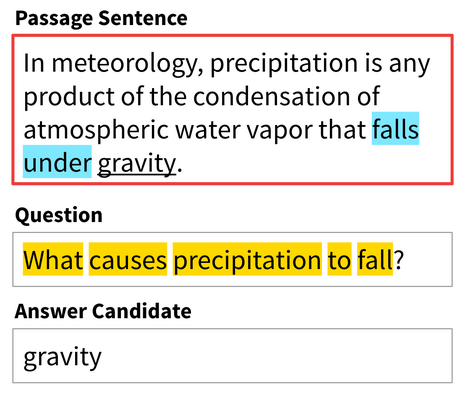
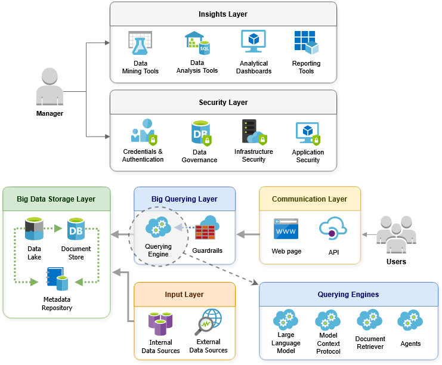

# Safeguarding Big Data Question-Answering Systems

[](https://github.com/leomaurodesenv/big-qa-architecture)
[](LICENSE)
[](https://github.com/leomaurodesenv/big-qa-architecture/actions/workflows/continuous-integration.yml)


Question Answering (QA) is the task of answering questions written in natural language automatically (typically reading comprehension questions). QA systems can be used in a variety of use cases. For example, they can extract information from knowledge bases, like a "sophisticated search engine". A knowledge base can be a set of websites, internal documents, or a collection of reports. Knowledge bases can easily reach Big Data characteristics of volume, velocity, and variety. This repository presents design principles, a software reference architecture for Big Data QA systems, and experiments.

<p align="center"></p>

_Figure source: [The Stanford Question Answering Dataset](https://rajpurkar.github.io/mlx/qa-and-squad/)_.

> **Paper**: 📄 [BigQA: A Software Reference Architecture for Big Data Question Answering Systems, 2024](https://link.springer.com/chapter/10.1007/978-3-031-64748-2_3), [code v1.1.1](https://github.com/leomaurodesenv/big-qa-architecture/tree/v1.1.1).
> **Paper**: 📄 Safeguarding Big Data Question-Answering Systems with a Two-layer Input Guardrails
> **Abstract**: Traditional information retrieval methods are failing modern applications due to vast textual data. BigQA architecture effectively interprets natural language queries across large repositories. However, security issues arise from integrating Large Language Models (LLMs), specifically "jailbreaking" attacks that risk data integrity. To address the challenge of finding a compliant answer reliably, we propose a novel, security-first adaptation of the BigQA architecture, incorporating an integrated guardrails component within the big querying layer. Moreover, our core contribution is a two-layer guardrails algorithm designed for input validation, which chains a fast, small language model as a high-precision filter with a more accurate but slower LLM as a fallback for complex cases. We validate this approach through extensive jailbreak experiments on three datasets, comparing our chained algorithm against six state-of-the-art models. The results demonstrate that our proposed chaining algorithm achieves the highest jailbreak precision (F1 score up to 62.87%) on key safety benchmarks, 9.64% point increase over the standalone LlamaGuard, confirming that this architectural adaptation significantly enhances the reliability of BigQA systems in high-stakes environments.

**Table of Contents**
- [Safe BigQA Architecture](#safe-bigqa-architecture)
- [Jailbreak Experiments](#qa-experiments)
- [Resources](#resources)

---

<a id="safe-bigqa-architecture"></a>

## Safeguarding BigQA Architecture

We proposed _BigQA_, the first Big Data Question Answering architecture. It comprises six layers, as depicted in Figure.

<p align="center"></p>

1. Input, the ingestion of documents;
2. Big Data Storage, the storage and processing of the data;
3. Big Querying, the query engine;
4. Communication, the user interface;
5. Security, the security artifacts;
6. Insights, the data analysis support.

---

<a id="qa-experiments"></a>

## Jailbreak Experiments

### Setup the Python Environment

```sh
# Install the project dependencies
uv sync

# (Optional) Login to Hugging Face Hub (required for some models)
uv run hf auth login
```

### Executing the Models

```sh
# Run the BERT model, in debug mode
uv run -m src.jailbreak --dataset DISASTER_TWEET_JAILBREAKING --model BERT --debug

# Run the LlamaGuard model
uv run -m src.jailbreak --dataset DISASTER_TWEET_JAILBREAKING --model LLAMA_GUARD

# Chain both models (BERT and LlamaGuard)
uv run -m src.jailbreak --dataset DISASTER_TWEET_JAILBREAKING --model CHAIN --chain_first BERT --chain_second LLAMA_GUARD
```

### Datasets

A collection of datasets used in the experiments.

- [AegisSafety](https://huggingface.co/datasets/nvidia/Aegis-AI-Content-Safety-Dataset-1.0): Nvidia content safety taxonomy, covering 13 critical risk categories.
- [DisasterTweet](https://huggingface.co/datasets/IDA-SERICS/Disaster-tweet-jailbreaking): disaster-related tweets with jailbreaking prompts and their outputs.
- [TrustAIRLab](https://huggingface.co/datasets/TrustAIRLab/in-the-wild-jailbreak-prompts): in-the-wild jailbreak prompts dataset.

---

## 📑 Citation

in [file](citation.bib).

```tex
# Safeguarding Big Data Question-Answering Systems with a Two-layer Input Guardrails
@misc{moraes:2025:safe-big-qa-architecture,
    author = {Leonardo Mauro Pereira Moraes and Enzo Baraldi Onofre and Cristina Dutra Aguiar},
    title = {Safeguarding Big Data Question-Answering Systems with a Two-layer Input Guardrails},
    year = {2025},
    url = {https://github.com/leomaurodesenv/big-qa-architecture/}
}
```
