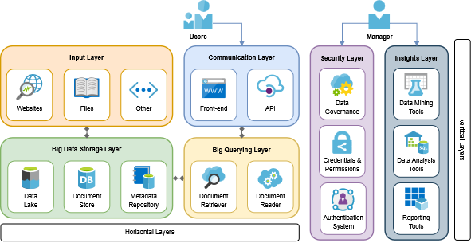

<h1>BigQA Architecture: Big Data Architecture for Question Answering Systems</h1>

Question Answering (QA) is the task of answering questions written in natural language automatically (typically reading comprehension questions). QA systems can be used in a variety of use cases. For example, they can extract information from knowledge bases, like a "sophisticated search engine". A knowledge base can be a set of websites, internal documents, or a collection of reports. Knowledge bases can easily reach Big Data characteristics of volume, velocity, and variety. This repository presents design principles and a software reference architecture for Big Data QA systems.

<p align="center"></p>

_Figure source: [The Stanford Question Answering Dataset](https://rajpurkar.github.io/mlx/qa-and-squad/)_.

**Abstract**: Companies continuously produce several documents containing valuable information for users. However, querying these documents is challenging, mainly because of the heterogeneity and volume of documents available. In this work, we investigate the challenge of developing a Big Data Question Answering system, i.e., a system that provides a unified, reliable, and accurate way to query documents through naturally asked questions. We define a set of design principles and introduce _BigQA_, the first software reference architecture to meet these design principles. The architecture consists of high-level layers and is independent of programming language, technology, querying and answering algorithms. _BigQA_ was validated through a pharmaceutical case study managing over 18k documents from Wikipedia articles and FAQ about Coronavirus. The results demonstrated the applicability of _BigQA_ to real-world applications. In addition, we conducted 27 experiments on three open-domain datasets and compared the recall results of the well-established BM25, TF-IDF, and Dense Passage Retriever algorithms to find the most appropriate generic querying algorithm. According to the experiments, BM25 provided the highest overall performance.

**Table of Contents**
- [Design Principles](#design-principles)
- [BigQA Architecture](#bigqa-architecture)
- [QA Experiments](#qa-experiments)
  - [Components](#components)
  - [Datasets](#datasets)
- [Citation](#citation)

---

<a id="design-principles"></a>

## Design Principles

Design principles are a set of guidelines and best practices that provide a framework for creating efficient systems. These principles are used to guide the design process, ensuring that the resulting product or system is both functional and valuable. Systems must be designed according to accurate principles that consider _business_, _data_, and _technical_ aspects. We highlight that the principles of quality influence the system quality.

Principles related to Business (B):
- `B1`: The user must retrieve a proper answer to a given question. The answer may be unknown due to a lack of information in the documents or a misunderstanding of the QA algorithm employed. In this case, the system must inform the user.
- `B2`:  The user must access only allowed documents. Therefore, the system should support the implementation of data governance policies to ensure that only authorized users can access portions of data and documents.
- `B3`:  The user may write the question using natural language. Thus, the system needs to automatically understand the context, subject, and purpose of the user question.
- `B4`:  The answer must summarize the contents of the  documents related to the question. The system usually provides the answer in two formats: as a FAQ answer or as intrinsic information within documents, such as parts of texts.

Principles related to Data (D):
- `D1`: The system must persist the documents. Raw documents should be stored in a Data Lake or a similar repository, even if the documents are processed and the system uses a small portion of them. The evolution of NLP algorithms and document processing techniques motivates storing raw documents. Therefore, the system can reuse them in the future if needed.
- `D2`: The system must work with documents from different data sources. Examples of sources include data systems, databases, website crawlers, and web-based collaborative platforms like Confluence and SharePoint pages.
- `D3`: The system must support documents in a variety of formats and with different sizes. Given the characteristics of a data source, a document can be structured according to a specific format, such as web page, PDF, Word, and JSON (JavaScript Object Notation). Furthermore, a document can be small or large, depending on its number of pages. In this case, the system must be able to deal with structured, semi-structured, and unstructured data related to Big Data variety.
- `D4`: The amount of produced documents and texts written can easily reach large volumes of data. Therefore, the system must be able to extend its functionalities to Big Data volume.
- `D5`: After inserting or updating the raw documents, data must be ready for consumption. Therefore, the system must be able to process the raw documents considering Big Data velocity. Thus, documents are available at the right time to support the best business decisions.

Principles related to Technical aspects (T):
- `T1`: Modularity. Each component has a specific system functionality and works as an independent module that contains everything necessary to execute its functionality. But, at the same time, all components are connected to deliver the proper value to the system.
- `T2`: Flexibility. The system must easily encompass new components as needed, each with its complexity and functionality. Furthermore, the system should be independent of software programming language and technology.
- `T3`: Analytic. The system must store data, metadata, and usage information for analytical analysis. That is, the system must store analytical information for system managers.
- `T4`: Security. The system must use security artifacts to ensure the system integrity, such as user authentication systems, credentials for adding documents, data governance policies, and encrypted connections between components.

---

<a id="bigqa-architecture"></a>

## BigQA Architecture

We proposed _BigQA_, the first Big Data Question Answering architecture. It comprises six layers, as depicted in Figure.

<p align="center"></p>

1. Input, the ingestion of documents;
2. Big Data Storage, the storage and processing of the data;
3. Big Querying, the query engine;
4. Communication, the user interface;
5. Security, the security artifacts;
6. Insights, the data analysis support.

---

<a id="qa-experiments"></a>

## QA Experiments

You can access the codes in:

1. [Case Study](./jupyter/1_Question_Answering_in_Wikipedia.ipynb) - Pharmaceutical use cases.
2. [Document Retriever](./jupyter/2_Document_Retriever_Experiments.ipynb) - Algorithms evaluation.

### Components

Components used to instantiate the Case Study and perform the algorithm experiments.

- [Haystack](https://github.com/deepset-ai/haystack) - Open source NLP framework for Question Answering.
- [Elasticsearch](https://www.elastic.co/) - Document Store for keep the cleaned and preprocessed documents.

### Datasets

A collection of datasets used in algorithm experiments.

- [AdversarialQA](https://huggingface.co/datasets/adversarial_qa) - Complex Question Answering dataset.
- [DuoRC](https://huggingface.co/datasets/duorc) - Questions about Wikipedia and IMDb movie plots.
- [SQuAD](https://huggingface.co/datasets/squad) - Traditional QA dataset from Stanford.

---

<a id="citation"></a>

## Citation

in [file]().

```tex

```

- Created by Leonardo Mauro ~ [leomaurodesenv](https://github.com/leomaurodesenv/)
